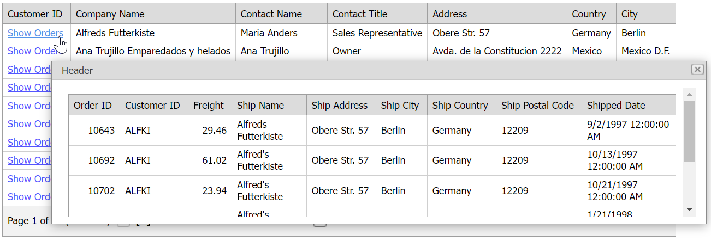

<!-- default badges list -->

[](https://supportcenter.devexpress.com/ticket/details/E20051)
[](https://docs.devexpress.com/GeneralInformation/403183)
<!-- default badges end -->
# Grid View for ASP.NET MVC - How to display detail data in a pop-up window
<!-- run online -->
**[[Run Online]](https://codecentral.devexpress.com/e20051/)**
<!-- run online end -->

This example demonstrates how to create a column's template, add a hyperlink to that template, and show a pop-up window with detail grid data on a hyperlink click.



## Overview

Call a column's [SetDataItemTemplateContent](https://docs.devexpress.com/AspNetMvc/DevExpress.Web.Mvc.MVCxGridViewColumn.SetDataItemTemplateContent.overloads) method and add a hyperlink control to the template. Handle the hyperlink's `Click` event. In the handler, specify the URL to the page with detail data, pass the URL as a parameter to the popup control's [SetContentUrl](https://docs.devexpress.com/AspNet/js-ASPxClientPopupControlBase.SetContentUrl(url)) method, and invoke a pop-up window.

```cshtml
settings.Columns.Add(col => {
    col.FieldName = "CustomerID";
    col.SetDataItemTemplateContent(container => {
        Html.DevExpress().HyperLink(hlSettings => {
            hlSettings.Name = string.Format("hl_{0}", (container as GridViewDataItemTemplateContainer).VisibleIndex);
            hlSettings.NavigateUrl = "javascript:void(0)";
            hlSettings.Properties.ClientSideEvents.Click = string.Format("function(s, e) {{ ShowDetailPopup('{0}'); }}", Url.Action("DetailAction", "Home", new { _customerID = (container as GridViewDataItemTemplateContainer).KeyValue.ToString() }));
            hlSettings.Properties.Text = "Show Orders";
        }).Render();
    });
});
```

```js
function ShowDetailPopup(url) {
    popup.SetContentUrl(url);
    popup.Show()
}
```

## Files to Review

* [HomeController.cs](./CS/DisplayDetailInPopupWindow/Controllers/HomeController.cs)
* [JSCustom.js](./CS/DisplayDetailInPopupWindow/Scripts/JSCustom.js)
* [Index.cshtml](./CS/DisplayDetailInPopupWindow/Views/Home/Index.cshtml)
* [DetailViewPartial.cshtml](./CS/DisplayDetailInPopupWindow/Views/Shared/DetailViewPartial.cshtml)
* [MasterViewPartial.cshtml](./CS/DisplayDetailInPopupWindow/Views/Shared/MasterViewPartial.cshtml)

## Documentation

* [Grid View Extension](https://docs.devexpress.com/AspNetMvc/DevExpress.Web.Mvc.GridViewExtension)
* [Popup Control Extension](https://docs.devexpress.com/AspNetMvc/DevExpress.Web.Mvc.PopupControlExtension)

## More Examples

* [Grid View for ASP.NET Web Forms - How to Display a Popup Dialog When a User Clicks a Link in a Grid Row](https://github.com/DevExpress-Examples/aspxgridview-display-popup-when-user-clicks-cell-link)
